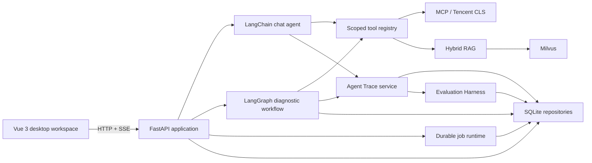

# Agent Harness Lab

[](https://github.com/kaiyueshao536-dotcom/agent-harness-lab/actions/workflows/ci.yml)
[](LICENSE)
[](apps/backend/pyproject.toml)
[](apps/frontend/package.json)

一个面向真实运维场景的 AI Agent 工程样板：把对话、RAG、MCP 工具调用和 LangGraph 诊断工作流放进可测试、可审计、按用户隔离的全栈系统。

[English architecture overview](docs/architecture.en.md) · [版本更新与复盘](CHANGELOG.md) · [安装指南](docs/setup/windows.md) · [真实日志与告警演示](docs/tutorials/real-log-and-alert.md) · [贡献指南](CONTRIBUTING.md)

## 为什么做这个项目

Agent Demo 很容易停在“模型能回答”。这个项目关注更难也更接近生产的部分：任务如何持久执行、工具如何受控调用、上下文如何管理、结果如何追溯，以及外部系统不可用时如何明确失败。

项目当前提供一个桌面 Web 工作台，演示从告警进入，到计划、执行、重规划、报告和案例沉淀的完整链路。它不会伪造 CLS 日志、工具结果或 AIOps 结论。

## 已实现能力

- **Agent runtime**：基于 LangChain `create_agent` 调用 OpenAI-compatible Qwen；流式聊天通过 SSE 输出文本、工具、引用、完成和错误事件。
- **诊断编排**：LangGraph `Planner → Executor → Replanner → Report`，支持持久任务、取消、重试、断线恢复、证据链和 Markdown 报告。
- **MCP 与真实日志**：管理用户级 MCP 连接；通过腾讯云官方 `cls-mcp-server` 查询真实 CLS 数据，并审计每次工具调用。
- **渐进式 Skill**：上传标准 `SKILL.md`；初始上下文只暴露名称和描述，需要时再加载正文。
- **上下文与记忆**：按会话选择轮次、窗口占用率或手动压缩策略；压缩保留摘要和完整历史。
- **RAG**：Markdown/PDF 切分，Milvus 向量检索与 BM25L 并行召回，RRF 融合、Qwen rerank 和可解释排名。
- **统一 Agent Trace**：Chat 与 AIOps 共享 Trace/Span 模型、SSE `traceId` 和工具 `spanId`；桌面端可按类型/状态筛选并查看有序执行时间线。
- **自动评测 Harness**：不可变版本数据集把真实 Trace 绑定到确定性质量规则，生成逐案例检查、聚合指标、质量门禁和同数据集基线差异；离线 CLI 与 CI 无需模型或云服务密钥。
- **工具失败恢复闭环**：MCP 连接重试以 `Tool → Attempt` 父子 Span 留痕；失败诊断可关联原 Job 重新执行，保留旧 Job/Trace，并用同一评测数据集验证恢复结果。
- **工程治理**：FastAPI/Pydantic v2、Vue 3/TypeScript、SQLite/Alembic、用户认证与 tenant 隔离、运行状态检查、OpenSpec 变更流程、无密钥 CI。

## 架构



核心边界和数据流见 [英文架构概览](docs/architecture.en.md)。

## 可演示链路

```text
Alertmanager 活跃告警
  → 创建持久诊断任务
  → 检索 SOP 并生成计划
  → 调用真实 CLS / 指标 / 告警工具
  → 根据证据继续或重规划
  → 生成可追溯报告
  → 保存为用户知识库案例
  → 在“执行追踪”中按 traceId 查看 Planner / Executor / Tool / Report Span
  → 在“自动评测”中创建数据集版本、绑定 Trace、运行门禁并对比基线
  → 外部工具失败时定位具体 Attempt，修复后关联重试并生成新 Trace
```

演示数据的上传和触发都是显式操作。完整步骤见[真实日志与告警教程](docs/tutorials/real-log-and-alert.md)。

## 快速开始

环境要求：Git、Docker、Node.js 24、npm、Python 3.12、[uv](https://docs.astral.sh/uv/)；真实日志演示还需要腾讯云 CLS 账号和官方 `cls-mcp-server`。

1. 克隆并创建仅保存在本机的配置：

   ```bash
   git clone https://github.com/kaiyueshao536-dotcom/agent-harness-lab.git
   cd agent-harness-lab
   cp config/project.template.json config/project.json
   cp config/user.project.template.json config/user.project.json
   ```

   Windows PowerShell 使用：

   ```powershell
   Copy-Item config/project.template.json config/project.json
   Copy-Item config/user.project.template.json config/user.project.json
   ```

2. 按[配置与运维说明](docs/operations-and-monitoring.md)填写本地配置。`config/project.json` 和 `config/user.project.json` 已被 Git 忽略，不要提交真实凭据。

3. 一键启动：

   ```bash
   ./scripts/start-local.sh
   ```

   Windows 命令提示符：

   ```text
   scripts\start-local.bat
   ```

启动后访问：前端 `http://127.0.0.1:5173`，后端 `http://127.0.0.1:8000`，就绪检查 `http://127.0.0.1:8000/ready`。

不同平台的依赖安装见 [Windows](docs/setup/windows.md)、[macOS](docs/setup/macos.md) 和 [Linux](docs/setup/linux.md)。

## 本地开发

Docker Compose **只**负责 etcd、MinIO、Milvus、Attu 和 Alertmanager；CLS MCP Server、后端与前端在本机进程中运行，便于调试和使用 AI Coding 工具。只启动基础设施：

```bash
docker compose -f infra/compose.yaml up -d etcd minio milvus attu alertmanager
```

随后可分别运行 `cls-mcp-server`、`uv run uvicorn super_ai.api.app:create_app --factory` 和 `npm run frontend:dev`。跨平台脚本 `scripts/start-local.sh` 与 `scripts\start-local.bat` 会串联这些步骤。

## 仓库结构

```text
apps/backend/           FastAPI、LangChain/LangGraph、SQLite、pytest
apps/frontend/          Vue 3、Vite、TypeScript、Vitest
packages/api-contracts/ 前后端共享 HTTP / OpenAPI / SSE 合同
config/                 可提交模板与被忽略的本地 JSON 配置
infra/                  Milvus、MinIO、etcd、Attu、Alertmanager
openspec/               功能提案、规格、任务与归档
docs/                   安装、架构、运维与演示文档
```

## 验证

CI 不读取任何模型或云服务密钥，执行与本地相同的静态和离线质量门禁：

```bash
npm ci
npx openspec validate --all
npm run contracts:typecheck
npm run frontend:typecheck
npm run frontend:test
npm run frontend:build

cd apps/backend
uv sync --frozen --dev
uv run ruff check .
uv run pyright
uv run super-ai-eval ../../evals/fixtures/p2-smoke-pass.json
uv run super-ai-eval ../../evals/fixtures/p3-tool-recovery-pass.json
uv run pytest
```

需要 Qwen、Milvus、Alertmanager 或 CLS 的集成能力由显式本地配置启用；普通 CI 不用 mock 数据冒充集成结果。

## 安全边界

- 密码使用 Argon2 哈希，不存储明文。
- 聊天、知识、向量、MCP、AIOps、反馈和审计数据按当前用户与 tenant 作用域访问。
- Trace 列表与详情同样按当前用户隔离；只保存安全摘要、状态、耗时和结构化标识，不保存完整提示词、思维链、模型密钥或原始工具凭据。
- 评测数据集、运行和结果按当前用户隔离；结果仅保存最多 500 字符的输出摘要、指标和规则检查，不复制完整提示词、思维链或原始工具输入输出。
- Milvus 记录 owner/user/tenant 元数据，检索时强制加入权限过滤。
- 应用只读取本地 JSON 项目配置，不从 `.env` 或机器环境变量加载业务密钥。
- 请通过 [GitHub Security Advisories](SECURITY.md) 私下报告漏洞，不要在 Issue 中粘贴凭据或日志原文。

## 当前限制与路线图

当前后台任务 worker 与 SQLite 同进程，适合本地演示和单实例评审，不是多节点生产部署方案。真实集成需要使用者自己的 Qwen、CLS 和基础设施配置。

下一阶段计划（尚未实现）：

- 可选 LLM-as-a-Judge、在线 live runner 与异步大规模评测；
- 多 Agent 协作和测试 Agent；
- PostgreSQL/队列支持的多实例任务执行。

路线图只表示计划，README 的“已实现能力”均可在当前代码和测试中定位。

## 开发与贡献

功能从一个聚焦的 OpenSpec 变更开始，保持 API/SSE 合同、权限边界和测试同步。具体流程见 [CONTRIBUTING.md](CONTRIBUTING.md)。

项目采用 [MIT License](LICENSE)。
