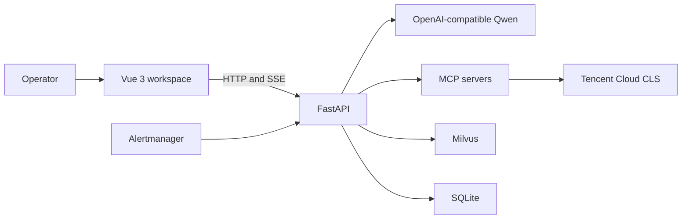
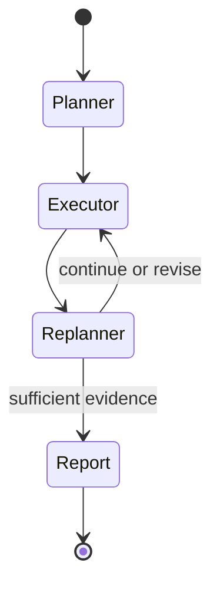

# Agent Harness Lab: Architecture Overview

Agent Harness Lab is a local-first engineering reference for building auditable AI agents around real operational data. The system combines a Vue desktop workspace, a FastAPI application, LangChain chat agents, a LangGraph diagnostic workflow, hybrid retrieval, durable jobs, and user-scoped MCP connections.

This document describes implemented behavior. Items in the README roadmap are explicitly not part of the current runtime.

## System context



The application does not manufacture an MCP profile or a diagnosis when an external dependency is unavailable. Readiness endpoints report the failing dependency, and runtime errors are represented in the API/SSE contracts.

## Runtime boundaries

### API and contracts

`apps/backend/src/super_ai/api/` owns HTTP composition, authentication dependencies, error mapping, readiness checks, and SSE responses. `packages/api-contracts/` is the shared TypeScript source for HTTP, OpenAPI, error-code, and SSE types used by the frontend.

The stable factory entry point is:

```text
super_ai.api.app:create_app
```

External clients should depend on HTTP and SSE contracts rather than backend repository implementations.

### Chat agent

The chat path uses LangChain `create_agent` with the configured OpenAI-compatible Qwen endpoint. Tools are assembled for the authenticated user and may include hybrid knowledge retrieval, current time, progressive Skill loading, and enabled MCP tools.

Only Skill metadata is placed in the initial prompt. The full `SKILL.md` body is loaded through a tool when the model decides it is relevant. Chat history is durable, while memory compaction produces summaries without deleting the complete message history.

### Diagnostic graph

The AIOps path uses a LangGraph state machine:



The planner retrieves applicable SOP knowledge, the executor invokes real scoped tools, the replanner evaluates gathered evidence, and the reporter creates a Markdown result linked to persisted evidence. Diagnostic work runs through the durable job runtime, so clients can reconnect to persisted events after an SSE interruption.

### Retrieval

Documents are stored and authorized in SQLite; vector chunks are stored in Milvus with owner, user, and tenant metadata. Retrieval runs vector search and in-memory BM25L in parallel, merges candidates with reciprocal rank fusion, and reranks them with the configured Qwen reranker. Citation payloads retain stage ranks and scores for inspection.

### Persistence and jobs

SQLAlchemy repositories isolate services from SQLite details, and Alembic owns schema migration. The durable job runtime persists attempts, leases, events, cancellation, retry policy, and resource ownership. The current implementation is deliberately single-process and is not a distributed queue.

### Unified Agent traces

Chat streaming and AIOps jobs create the same owner-scoped execution model. One trace represents a Chat session turn or diagnostic task; ordered spans represent agent, planner, executor, replanner, tool, retrieval, model, and report stages. Every emitted SSE event carries the execution `traceId`, while the start and completion events for one tool call reuse the same `spanId`.

The authenticated query API exposes `GET /agent-traces` and `GET /agent-traces/{traceId}`. The Vue desktop workspace uses these endpoints for type/status filters, summary metrics, and a sequence-ordered timeline. Cross-owner reads return not found, so a trace identifier does not reveal whether another user's execution exists.

Trace persistence is intentionally an operational projection rather than a transcript. It stores lifecycle status, timing, safe summaries, resource/request identifiers, and redacted structured attributes. It does not store complete prompts, chain-of-thought, model credentials, or raw tool credentials. Trace write failures are logged and execution continues, preventing observability persistence from becoming a Chat or AIOps availability dependency.

## Trace-backed evaluation harness

The evaluation layer replays owner-scoped P1 traces through a closed set of deterministic rules. Immutable dataset versions define cases and release gates; each run binds every case to one compatible trace, resolves only the final persisted business output plus safe trace metrics, and stores explainable checks and a 500-character output summary. Baselines must belong to the same owner and dataset.

This layer deliberately does not invoke the LLM, MCP, or Tencent CLS. The same traces can therefore be evaluated repeatedly without cloud-query cost or nondeterministic model output. A secretless offline CLI uses the same scoring kernel in CI. LLM-as-a-Judge and a live Agent runner remain future extensions.

## Trust and authorization boundaries

- Registration, login, and logout are supported; passwords are Argon2 hashes.
- Knowledge bases, chats, diagnostics, feedback, MCP connections, audit records, and vector search are scoped to the authenticated owner and tenant.
- Agent traces and spans are owner-scoped and expose only safe operational summaries.
- MCP tool results and external failures are recorded in tool-call audits.
- Project secrets live only in ignored local JSON configuration. Committed `*.template.json` files contain no real credentials.
- CI runs specification, lint, type, test, and build checks without cloud or model secrets.

## Repository map

| Path | Responsibility |
| --- | --- |
| `apps/backend/` | FastAPI, agent services, graph workflow, repositories, migrations, tests |
| `apps/frontend/` | Vue desktop UI, SSE clients, state, component and route tests |
| `packages/api-contracts/` | Shared TypeScript contracts |
| `infra/` | Local Milvus, MinIO, etcd, Attu, and Alertmanager infrastructure |
| `config/` | Safe templates and ignored local project configuration |
| `openspec/` | Proposed, active, and archived behavior changes |
| `docs/` | Setup, operations, architecture, and demonstration guides |

## Verification

The repository's GitHub Actions workflow runs OpenSpec validation, shared-contract type checking, frontend type checking/tests/build, and backend Ruff/Pyright/pytest. See the root [README](../README.md#验证) for exact commands.
