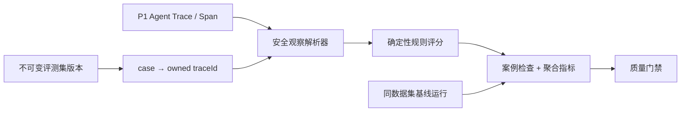

# 自动评测 Harness

P2 在 P1 统一 Agent Trace 之上增加了可复现的回归评测层。它不重新调用模型，也不查询腾讯云 CLS，而是读取当前用户已经保存的 Chat/AIOps Trace、最终业务输出和安全结构化指标，再执行确定性规则。因此，同一批 Trace 可以反复评测，不产生新的模型或 CLS 调用费用。

## 数据流



支持的规则是封闭集合：

- `contains_all`、`excludes_all`：检查最终输出文本；
- `required_tools`：检查 Trace 中的工具 Span 名称；
- `min_references`：检查引用或证据数量；
- `max_duration_ms`、`max_tool_calls`：约束执行成本；
- `trace_succeeded`：要求 Trace 成功结束。

每条规则权重相同。案例全部规则通过才算通过；运行报告包含通过率、平均分、平均耗时、工具调用总数、门禁失败原因，以及相对基线的分数、通过率、耗时和工具数变化。

## 桌面演示

1. 先在“对话”或“智能诊断”完成真实任务，并在“执行追踪”确认 Trace 已成功。
2. 打开“自动评测”，创建名称和版本唯一的不可变评测集。
3. 为每个案例选择执行类型和规则；只填写任务摘要，不粘贴完整敏感提示词。
4. 为每个案例绑定一个同类型、当前用户可见的成功 Trace。
5. 输入候选版本名，可选一个同数据集历史运行作为基线，然后运行评测。
6. 查看门禁、逐案例规则失败和安全输出摘要，并跳转到对应 Trace 定位问题。

## 无密钥 CLI 与 CI

在仓库根目录执行：

```bash
cd apps/backend
uv run super-ai-eval ../../evals/fixtures/p2-smoke-pass.json
uv run super-ai-eval ../../evals/fixtures/p3-tool-recovery-pass.json
```

CLI 严格校验 JSON fixture，输出 JSON 报告。门禁通过退出码为 `0`，门禁失败为 `1`，fixture 无效为 `2`。CI 使用 `p2-smoke-pass.json`，不读取 Qwen、Milvus、MCP 或 CLS 密钥。

`p2-smoke-fail.json` 是失败报告演示，不应接入必须通过的 CI step。

## 安全与当前边界

- API、数据集、案例、运行、结果和 Trace 绑定全部按 owner 隔离；跨用户资源按不存在处理。
- 数据集版本创建后不可修改；相同 owner 下的名称与版本不能重复。
- 持久化结果只包含最多 500 字符的折叠输出摘要、指标和规则检查，不保存完整提示词、思维链、模型密钥、CLS 凭据或原始工具输入输出。
- 当前 API 同步评测最多 100 个案例，适合项目演示和小型回归集。
- P2 不包含 LLM-as-a-Judge、自动重新运行 Agent 或异步大规模调度；这些属于后续 live runner/Judge 路线。
