# P0—P2 亲手跑通与 MCP 故障演练

日期：2026-08-08

## 学习目标

1. 亲手跑通 Chat/AIOps → Trace → Evaluation。
2. 主动制造一次 MCP 不可用，并完成故障恢复验证。
3. 能解释 Trace、Span、Evaluation Dataset、Baseline 和 Gate。
4. 画出项目的数据流图。
5. 单独维护尚未掌握的代码与概念。

## 环境预检

- SQLite、Milvus、Qwen 和 MCP 配置检查通过。
- MCP 健康检查发现 19 个工具。
- FastAPI 后端运行于 `127.0.0.1:8000`。
- Vue 前端运行于 `127.0.0.1:5173`。
- CLS MCP Server 运行于 `127.0.0.1:3000`。

本记录不包含任何模型密钥或腾讯云凭据。

## 实验一：Chat → Trace

Chat 要求 Agent 调用 `get_current_time`，执行成功。

- Trace：`trace_2ced3da10bea43e987c106cafb91bcac`
- 状态：`succeeded`
- 总耗时：4,677 ms
- Span 数量：2
- `chat.agent`：4,654 ms
- `get_current_time`：26 ms

结论：Trace 表示一次完整执行，Span 表示执行中的可观测步骤。Agent Span 和工具 Span 存在时间包含关系，不能简单相加得到 Trace 总耗时。

## 实验二：AIOps → Trace

使用真实 MCP/CLS 工具执行智能诊断，执行成功。

- Trace：`trace_385254910f73422d9d8b5a329dcc683d`
- 诊断任务：`diagnostic_534d8d76a9c048188ec8772b48a805cf`
- 状态：`succeeded`
- 总耗时：83,209 ms
- Span 数量：13
- 工具审计：`knowledge_retrieval` 1,018 ms，`SearchLog` 653 ms

### 发现的问题：AIOps Span 边界不准确

Trace 页面中的工具 Span 只记录了约 23—24 ms，但工具审计记录的真实耗时分别为 1,018 ms 和 653 ms。现有 Span 更接近执行完成后的状态持久化标记，没有完整包裹真实工具执行区间，因此不能用来代表真实阶段耗时。

同时，当前 AIOps Span 均为平铺时间线，`parentSpanId` 为空，尚未表达父子调用关系。

## 实验三：自动评测

创建不可变数据集版本 `P0-P2 学习回归集 / v1`，包含两个 Case：

1. Chat 必须调用 `get_current_time`。
2. AIOps 必须调用 `SearchLog`。

评测结果：

- Gate：通过
- 通过率：100%
- 平均分：100%
- 平均耗时：43,943 ms
- 工具调用总数：3

计算依据：

```text
(4,677 + 83,209) / 2 = 43,943 ms
1 次 Chat 工具调用 + 2 次 AIOps 工具调用 = 3 次
```

建立 Baseline 后，使用完全相同的 Trace 再次评分，四项变化均为 0。这只验证了 Baseline/Gate 的操作流程，不代表修改后的 Agent 没有退化。真实回归评测必须在修改 Agent 后重新执行相同输入，产生新的 Candidate Trace。

### 自动评测的边界

- 当前评测只读取已保存 Trace，不重新调用模型或 CLS。
- `required_tools` 只能证明工具名称出现过，不能证明参数和结果正确。
- Baseline 是历史 Evaluation Run，不是单独一条 Trace。
- Gate 根据通过率、平均分和耗时回归阈值作出确定性判断。

### 学习过程中发现的评测 UI/后端差异

- 后端 Evaluation Service 能解析 `succeeded` 或 `failed` Trace，并通过 `trace_succeeded` 规则判断最终状态。
- 后端 Dataset 模型允许一个 Case 定义 1～20 条规则。
- 当前前端只请求 `status=succeeded` 的 Trace，因此页面无法选择失败 Trace，`trace_succeeded` 规则在 UI 路径中缺少失败样本验证。
- 当前前端 Case Builder 每次只把一条规则写入 `rules`，没有为同一 Case 追加多条规则的交互。

这意味着只检查 `required_tools=SearchLog` 的 API 调用可能让“调用过但调用失败”的 Trace 通过，而页面侧又无法直接复现该负例。该问题属于评测用例设计与前后端能力对齐问题，后续可作为独立优化候选；本轮学习不绕过认证或直接修改数据库制造结果。

## 实验四：主动制造 MCP 故障

只停止本项目监听 3000 端口的 CLS MCP Node 进程，保留前端、后端和数据库运行。`/health/mcp` 从 HTTP 200 变为 HTTP 503。

随后使用相同输入创建新的 AIOps 诊断任务，得到真实失败：

- Trace：`trace_deb6b44e6acd4c0299a4aa4c473d3ee8`
- 诊断任务：`diagnostic_1f87bebf8c3941f091dd6699667681fe`
- 后台 Job：`job_8e3b35f2f11044b991bd02e99b5c6f05`
- Trace 状态：`failed`
- 错误分类：`DiagnosticExecutionFailed`
- Trace 总耗时：87,873 ms
- `SearchLog` 工具审计耗时：4,686 ms
- `SearchLog` Trace Span 耗时：61 ms
- 错误：`MCP server unavailable at http://127.0.0.1:3000/sse`
- 后台任务尝试：`attempt=1`，`max_attempts=1`

失败后图仍执行了 Replanner 和 Report，最终输出证据不足的报告，因此用户不是立即看到失败。MCP 客户端的 `retries=1` 表示单次工具调用最多执行首次尝试和一次重试；后台 Job 的 `max_attempts=1` 表示整个诊断任务不会自动重试。

### 故障恢复验证

恢复 MCP 后，健康检查重新发现 19 个工具。用户使用相同输入手动创建了新任务：

- 新 Trace：`trace_deb0d0dc735e4fb08cc70a3ee3d611fa`
- 新诊断任务：`diagnostic_36f4a3c17d3f47ed8d4e592b357d7c45`
- 新后台 Job：`job_a6cb52d7f14e4ed1a959a6dc34549dbf`
- Trace 状态：`succeeded`
- 总耗时：71,267 ms
- `SearchLog` 工具审计耗时：779 ms
- `SearchLog` Trace Span 耗时：33 ms

这次恢复是用户手动创建新任务，不是原任务重试。前端目前没有提供诊断任务重试入口，虽然后端存在通用 Background Job retry API，其对 AIOps 的完整适用性仍需单独验证。

## 当前数据流图

```mermaid
flowchart TD
    subgraph Chat["Chat 链路"]
        C1["浏览器"] --> C2["FastAPI Chat SSE"]
        C2 --> C3["创建 running Trace"]
        C3 --> C4["Chat Agent"]
        C4 --> C5["工具调用"]
        C5 --> C6["写入 Tool Audit 和 Span"]
        C6 --> C7["结束 Trace"]
        C7 --> C8["前端展示"]
    end

    subgraph AIOps["AIOps 链路"]
        A1["浏览器"] --> A2["创建诊断任务"]
        A2 --> A3["SQLite Background Job"]
        A3 --> A4["后台 Runtime 领取任务"]
        A4 --> A5["创建 running Trace"]
        A5 --> A6["LangGraph"]
        A6 --> A7["知识库 / Milvus"]
        A6 --> A8["MCP / 腾讯 CLS"]
        A7 --> A9["Replanner 和诊断报告"]
        A8 --> A9
        A9 --> A10["保存证据和报告"]
        A10 --> A11["结束 Trace"]
        A11 --> A12["前端展示"]
    end

    subgraph Evaluation["Evaluation 链路"]
        E1["Evaluation Dataset"] --> E3["确定性评分"]
        E2["Candidate 保存的 Trace"] --> E3
        E3 --> E4["Evaluation Run"]
        E5["Baseline Evaluation Run"] --> E6["指标对比"]
        E4 --> E6
        E6 --> E7["Gate"]
    end
```



## 初始未掌握的代码与概念

评分标准：0 表示基本不理解，1 表示能说出大概意思，2 表示可以向面试官解释。

| 概念 | 初始自评 |
| --- | ---: |
| FastAPI SSE | 0 |
| 后台 Job 生命周期 | 0 |
| LangGraph | 0 |
| Planner / Executor / Replanner / Report | 1 |
| MCP | 0 |
| Trace 生命周期 | 0 |
| Span | 0 |
| Tool Audit 和 Span 的区别 | 0 |
| Evaluation Dataset | 0 |
| Baseline | 1 |
| Gate | 0 |
| MCP 调用重试和后台任务重试的区别 | 0 |

## 后续学习顺序

1. 请求与执行：FastAPI SSE、后台 Job、LangGraph、MCP。
2. 可观测性：Trace 生命周期、Span、Tool Audit。
3. 自动评测：Evaluation Dataset、Baseline、Gate。
4. 可靠性：MCP 调用重试与后台任务重试。

完成每层后，用自己的话复述数据流，并结合本页中的真实 Trace 或 Job 解释，不以背诵定义作为掌握标准。

## 学习检查记录

### 第一层：请求与执行

检查日期：2026-08-08

- 能解释 `202 Accepted` 表示诊断任务已登记，但报告尚未生成。
- 能区分浏览器连接与后台 Runtime：浏览器只是任务观察者，后台 Runtime 才是执行者。
- 能说明当前 Runtime 与 FastAPI 同进程，因此浏览器关闭不影响已登记任务，但后端进程故障仍可能中断执行。
- 能说明工具链职责：Planner/Agent 决定调用 `SearchLog`，MCP Client 发送协议请求，CLS MCP Server 转换腾讯云请求，腾讯云 CLS 保存和查询真实日志。
- 能区分前端 SSE 与 MCP SSE 的连接对象和用途。

阶段判断：FastAPI SSE、后台 Job、LangGraph 和 MCP 已从“基本不理解”进入“能结合本项目说出主流程”，后续仍需通过代码定位提升到可独立讲解。

### 第二层：可观测性

检查日期：2026-08-08

- 能解释 Trace 是一次完整执行档案，Span 是 Trace 中的可观测步骤。
- 能解释 `aiops.graph` 包含内部阶段，因此不能把父阶段和内部 Span 耗时直接相加。
- 能说明当前排查工具性能时，应优先使用 Tool Audit 的真实调用耗时，而不是边界不准确的 AIOps 工具 Span。
- 能区分 Tool Audit 的参数、结果、错误、安全与性能审计用途，以及 Span 的执行顺序、阶段和调用关系用途。
- 需要继续强化 Trace 提前创建的原因：先创建 `running` Trace，才能保留执行中证据，并在成功或异常时完成最终状态；若只在结束后创建，中断执行可能没有完整记录。

阶段判断：Trace、Span 和 Tool Audit 已进入“能结合真实数据解释差异”，下一步需要定位对应仓储和埋点代码。

### 第三层：自动评测

检查日期：2026-08-08

创建 `P0-P2 Gate 失败演示集 / v1`，用两条成功 Trace 验证 Gate：

1. Chat Case 使用 `trace_succeeded`，绑定 `trace_2ced3da10bea43e987c106cafb91bcac`，结果 100%。
2. AIOps Case 使用 `max_duration_ms=60000`，绑定状态为 `succeeded`、耗时 71,267 ms 的 `trace_deb0d0dc735e4fb08cc70a3ee3d611fa`，结果 0%。

评测运行：`eval_run_d7010936a61e4f2382614ad9687f0919`

- Candidate：`walkthrough-gate-failure`
- Gate：失败
- 通过率：50%
- 平均分：50%
- 平均耗时：37,972 ms
- 工具调用：3
- Gate failures：通过率和平均分均低于 100% 门槛

结论：Trace 的 `succeeded` 只表示程序执行完成，不表示结果符合功能、质量、延迟或成本要求。Dataset 定义可解释规则，Evaluation Run 保存一次评分，Baseline 是同一 Dataset 的历史 Run，Gate 只根据已定义规则和聚合阈值判断候选是否达标。

阶段判断：Evaluation Dataset、Baseline 和 Gate 已能通过一次真实 Gate 失败解释；仍需避免把过弱或无法产生负例的规则误当作有效质量保障。

### 第四层：可靠性与重试

检查日期：2026-08-08

- 能解释 `mcp.retries=1` 表示首次尝试加一次重试，最多调用两次。
- 能区分 MCP 工具重试只重复一次工具调用，后台 Job 重试可能重新执行整个诊断流程。
- 能根据新的 Diagnostic Task、Job、Trace 以及空的 `retry_of_job_id`，判断 MCP 恢复后的操作是用户重新提交，而不是原任务重试。
- 能解释只读 `SearchLog` 相对适合重试；创建工单等副作用操作需要幂等键、错误分类、最大尝试次数和退避策略，避免重复执行。
- 能用一句话解释 Dataset、Baseline、Gate，以及 `succeeded` Trace 仍可能因功能、质量、延迟或成本规则不达标而评测失败。

阶段判断：四层概念检查均已通过主流程复述。当前整体处于“能结合真实运行解释概念”的阶段，尚未达到“能独立定位并修改核心代码”的阶段，后续代码走读后再把自评提升为 2。

## 核心代码导航

### 请求与后台任务

- `apps/backend/src/super_ai/api/app.py:1335`：Chat SSE 路由。
- `apps/backend/src/super_ai/api/app.py:1412`：创建 AIOps 诊断任务和后台 Job。
- `apps/backend/src/super_ai/api/app.py:1576`：读取后台事件的 AIOps SSE 路由。
- `apps/backend/src/super_ai/api/app.py:388`：通用 Background Job retry API。
- `apps/backend/src/super_ai/jobs/runtime.py:51`：后台 Job 的领取、执行、失败和重试调度。

### LangGraph 与 MCP

- `apps/backend/src/super_ai/aiops/graph.py:31`：Plan-Execute-Replan-Report 图定义与编译。
- `apps/backend/src/super_ai/aiops/diagnostics.py:86`：AIOps 开始 Trace。
- `apps/backend/src/super_ai/aiops/diagnostics.py:280`：Planner 阶段入口。
- `apps/backend/src/super_ai/aiops/diagnostics.py:469`：Executor 执行工具步骤。
- `apps/backend/src/super_ai/aiops/diagnostics.py:623`：Replanner 根据证据决策。
- `apps/backend/src/super_ai/aiops/diagnostics.py:661`：Report 阶段。
- `apps/backend/src/super_ai/mcp_client.py:60`：本地 MCP Client。
- `apps/backend/src/super_ai/mcp_client.py:213`：`retries + 1` 次 MCP 调用尝试。

### Trace 与 Span

- `apps/backend/src/super_ai/tracing.py:38`：统一 Trace Service。
- `apps/backend/src/super_ai/tracing.py:44`：创建 `running` Trace。
- `apps/backend/src/super_ai/memory/trace_sqlite.py:14`：Trace/Span 的 SQLite 持久化仓储。
- `apps/backend/src/super_ai/chat/streaming.py:218`：Chat 开始 Trace。

### Evaluation Harness

- `apps/backend/src/super_ai/evaluation/models.py:22`：规则、Dataset 和 Gate 模型。
- `apps/backend/src/super_ai/evaluation/service.py:35`：绑定 Trace、汇总结果并创建 Evaluation Run。
- `apps/backend/src/super_ai/evaluation/scoring.py:24`：单 Case 确定性评分。
- `apps/backend/src/super_ai/evaluation/scoring.py:45`：Gate 判定。
- `apps/frontend/src/views/EvaluationView.vue:56`：前端只加载成功 Trace。
- `apps/frontend/src/views/EvaluationView.vue:91`：前端目前每个 Case 只暂存一条规则。

## 当前掌握程度

四层概念均从初始的 0/1 提升到“1：能够结合本项目真实 Trace、Job 和 Evaluation Run 解释”。暂不标记为 2，因为还没有逐个打开上述代码入口、追踪调用栈并独立完成修改。下一阶段应进行代码走读，并让学习者亲自指出 P3 改动位置和测试入口。
